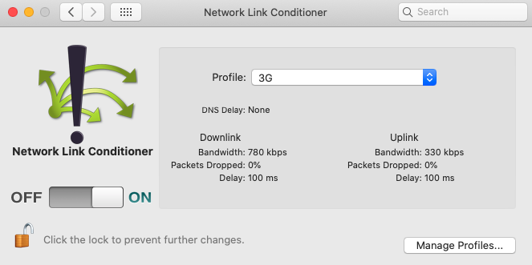
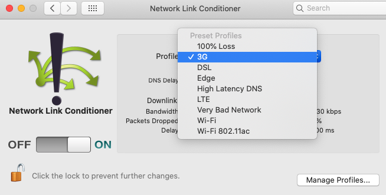

# BLoC in Flutter to get images from IP and pagination

Biggest challenge of this project :
- Adapt to the API, is there pages (20 items by API calls) or can you fix the limit in the HTTP call
- Two separate flow of async, get the name and urlImagePath of the picture, and then download the picture
- Download the picture with Image.network or NetworkAssetBundle(Uri.parse(imgUrl)).load("")).buffer.asUint8List() and then Image.memory

API and project from : https://www.themoviedb.org/settings/api?language=fr

Documentation on the API : https://developers.themoviedb.org/3/movies/get-popular-movies

Other good place to test API, JSONPlaceHolder : http://jsonplaceholder.typicode.com/

Guide for using the API : https://medium.com/flutterpub/architecting-your-flutter-project-bd04e144a8f1

Setup slow internet : 
- https://medium.com/macoclock/ios-simulator-simulates-slow-network-connection-615f910a2f43 
- https://developer.apple.com/download/more/?=for%20Xcode 
- Download Additional_Tools_for_Xcode then install Hardware > Network Link Conditioner.prefPane

## Without any optimisation of the structure of the code

## By tacking FlutterBlocInfiniteList with image db
BLoC infinite list : https://bloclibrary.dev/#/flutterinfinitelisttutorial

## Intermediary result 1. commit 04bbb800 on branch bloc_api_optimised_code
On 3G 

## Intermediary result 2. commit 92e49a1e47 on branch bloc_api_optimised_code
On 3G 
Loading 20 pictures for every pages takes too much times. Nearly 20 seconds for the first page 
